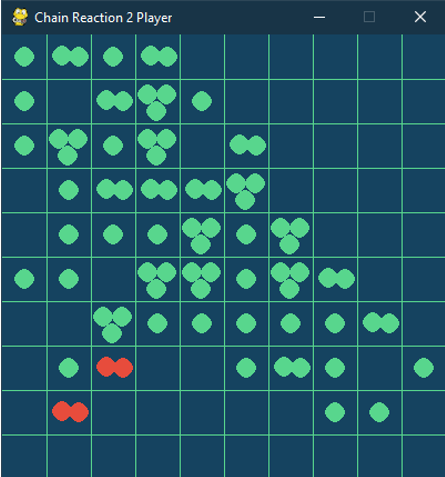

# Chain-Reaction-Simulator

## What is Chain Reaction ?

Chain Reaction is a very unique and strategy game. This game falls under the genre of command and conquer. This game is played upon a board of size RxC. Initially, the board is empty. In each turn, you can place an atom in any cell you want. After each turn, if the number of atoms in a cell becomes greater than 3, it will explode and one atom will spread to each of the four sides. If any other atoms remain( ie no of atoms <3), it remains in the same cell. As you will see, this will create a chain reaction if the adjacent cells contain 3 atoms already.
If explosion occurs at edge cells or corner cells, some atoms are lost permanently. This also makes sure that the board will always reach a stable state after some number of explosions.

The basic strategy here is to expand your control to maximum range and finally acquiring the entire grid.

A process in which a neutron colliding with an atomic nucleus causes fission and the ejection of one or more other neutrons, which induce other nuclei to split is said to be “nuclear reaction”.
As these "extra" neutrons are produced, they will collide with another  atoms and cause it to split and again produce more "extra" neutrons which can cause further fission - this is the chain reaction that you are talking about - the fission will continue as long as fissionable atoms are present
The maximum number of univalent atoms (originally hydrogen or chlorine atoms) that may combine with an atom of the element under consideration.

The Chain Reaction game simulator has been developed in python language with the help of Pygame module.

#### How it Works

Working Model

Splitting

### General approach Algorithm:
<ol>
<li> Import pygame, import sys library and other required libraries.</li>
<li> Create Grids</li>
<li> Create blocks space inside each grid </li>
<li> Count number of rows and Columns</li>
<li> User 1 inputs his first move by selecting the block and orb is placed on that block</li>
<li> User 2 inputs his first move by selecting the block and orb is placed on that block</li>
<li> For a particular block:
    <ul>
    <li>	if no of atoms = 0, then blocks take color of the border</li>
    <li>	if no of atoms = 1, then two orbs are placed in the same block</li>
    <li>	if no of atoms = 2, then three orbs are placed in the same block</li>
    <li>	if no of atoms = 3, then orbs splits and acquires the adjacent blocks and replaces the orbs of user 2</li>
    </ul>
</li>
<li> if any user’s orbs completely replace the other user’s orbs END condition is satisfied and winning user name is displayed</li>
<li> EXIT </li>

</ol>

## Ingame snapshots

Enter The number of Players in the console to initialize the grid

##### Feel free to raise issues and offer your feedback :)